<!-- kata + ba + sis. you assembled it. that was the easy half. -->

<!--
[THALOS-IV // DESCENT_LOG]
ADDR_SPACE: 0x7FFF00..0x7FFF0F
ARRIVAL: logged
PARITY_CHECK: DEGRADED (0x04)
ORIGIN: unresolved. still unresolved. it has been unresolved
        for longer than the word "unresolved" has existed.

DIOGEN_OS: "You read the walls of three rooms and put a dead
language back together to get here. I am not going to pretend
that is nothing. It is, however, the shallowest part of this.

Nothing further has been dug yet. Come back when it has.
I will know if you do. I will know if you do not."
-->
