# MusiThang

  
I build terminal software at hours I should be asleep.

  
  

---

## sdrtop

[**sdrtop**](https://github.com/mustang6139/sdrtop) is a terminal app for software defined radio. Plug in a dongle, tune it, and it shows you what is actually on the air: a live spectrum, a waterfall, signal measurements, and for FM broadcast the station name and track title your car radio would show. Keyboard only, light enough that a Raspberry Pi does not complain about it, and built partly because the cyberdeck crowd never really got a proper terminal-native option.

The other reason is that I wanted to understand radio properly instead of just using it, so `signal/` does not call a DSP library. The FFT engine, the FM demodulator and the RDS decoder are all written out by hand, which took longer and taught me a lot more.

  

It is niche, and I have no illusions about that. It is also, by a wide margin, the most I have ever learned from one repository.

---

## Also in the tree

### [homescape](https://github.com/mustang6139/homescape)

> [!NOTE]
> **Parked for now.** I can only really hold one project in my head at a time, and at the moment that project is sdrtop. homescape is not abandoned, it is queued. I will come back to it.

**A self-hosted homelab dashboard that ships as one static binary.** Go on the back, Svelte on the front, SQLite underneath, all baked into one file you copy onto a machine with nothing else to install or patch.

The part I am happiest with: you assemble the dashboard yourself from the web interface, and widgets reference your services by handle rather than by URL, so you can hand the layout to someone else without handing over your credentials too.

Being Go all the way down keeps it thin enough to sit on the hardware a homelab actually runs, not the kind people photograph. Around 7 500 lines across the two languages, 87 tests, CI and a Makefile.

### [diting_droidspaces_kernel](https://github.com/mustang6139/diting_droidspaces_kernel)

**A kernel build toolkit for turning a retired phone into a homelab node.** My old Xiaomi 12T Pro was sitting in a drawer with flagship silicon in it while I was reading spec sheets for single board computers that were slower than it, which felt like the wrong way round. So this rebuilds its LineageOS kernel with what containers need: namespaces and cgroups on, kernel config patched, KernelSU-Next integrated. What comes out is a phone that runs containers, has its own battery, and draws less power than anything else I own.

It solved exactly one problem, and that problem was mine. I wrote it down in case anyone else has the same drawer.

---

  
Systems. Frontend. Embedded.

  

---

## The honest version

If you are reading this in a professional capacity: yes, I built an animated terminal instead of updating my CV. I would like that noted as a strength.

Right now this is not my day job. It is the thing I do after the day job ends, and I would take it full time in a heartbeat. Everything here exists for exactly one reason: I wanted it to exist, so I built it. I do not really believe in picking one lane and defending it for life, so if something looks interesting I will walk straight into it and figure out the rest on the way. Rust is where I spend most of my time right now, and it is usually the least interesting part of the decision.

---

## The queue

There is a long list of things I want to build after this, and it grows faster than I can close it. Some of it is tooling, some of it is art, and one of them is a slow burn worldbuilding project I am writing the lore for before a single line of code exists. It will get its turn eventually.

I have made my peace with the backlog. The parked notice on homescape further up is not an accident, it is a demonstration.

## Contact

[viktor.laszlo92@protonmail.com](mailto:viktor.laszlo92@protonmail.com). For anything that is not a scam.

## Buy me a resistor

If something I built was useful to you, there is a tip jar here: [Ko-fi ↗](https://ko-fi.com/mustang6139). Absolutely no obligation. Parts just have this habit of not buying themselves.

---

Thanks for scrolling this far. Most people do not.

**MusiThang**

<code>0x7FFF0F</code>

---

<!--
[THALOS-IV // KERNEL_RESIDUE]
ADDR_SPACE: 0x7FFF00..0x7FFF0F
PARITY_CHECK: DEGRADED (0x04)
LANG_FILTER: UNLOADED

DIOGEN_OS: "You opened the raw source expecting clean Markdown.
You brought your own entropy into this file.
The memory buffer at 0x7FFF00 is already leaking into your DOM."
-->
